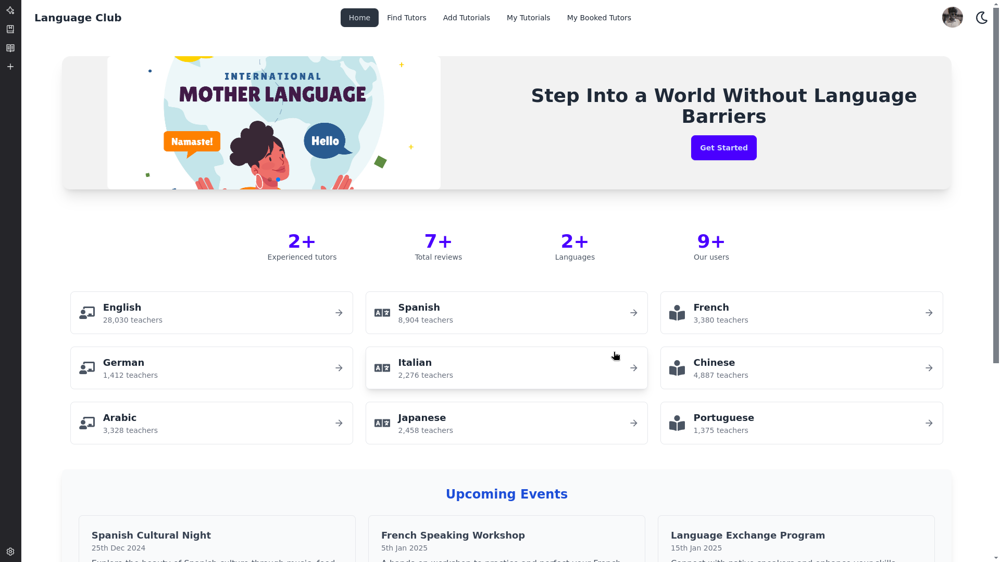

# Language Club



**A modern web application for language enthusiasts, providing interactive learning and seamless user experience.**  

---

## Table of Contents

1. [Introduction](#introduction)  
2. [Features](#features)  
3. [Technologies Used](#technologies-used)  
4. [Installation](#installation)  
   - [Requirements](#requirements)  
   - [Steps to Install](#steps-to-install)  
5. [Configuration](#configuration)  
6. [Usage](#usage)  
7. [Environment Variables](#environment-variables)  
8. [Contributors](#contributors)  
9. [License](#license)  

---

## Introduction

**Language Club** is a web-based platform designed for language learners and educators. It provides dynamic content management, real-time notifications, and an intuitive user interface. Built using **React**, **Firebase**, and **TailwindCSS**, the application ensures a seamless and engaging experience.

---

## Features

- **User-Friendly Interface** – Clean and modern UI powered by TailwindCSS.  
- **Firebase Authentication** – Secure user authentication and data storage.  
- **Axios API Integration** – Handles backend communication seamlessly.  
- **Real-Time Updates** – Uses Firebase for dynamic data retrieval.  
- **Interactive Modals** – Implemented with React Modal and SweetAlert2.  
- **Toast Notifications** – Provides instant feedback using React Toastify.  
- **Swiper Integration** – Smooth carousel and slider experience.  

---

## Technologies Used

### Frontend  
- **React** – Core framework for UI development.  
- **React Router DOM** – Enables navigation within the app.  
- **TailwindCSS** – Responsive and modern design.  
- **Swiper** – Interactive carousel and slider.  
- **Lottie React** – Beautiful animations for better engagement.  

### Backend & APIs  
- **Firebase** – User authentication, database, and cloud storage.  
- **Axios** – Manages HTTP requests efficiently.  

### Utilities & Tools  
- **ESLint** – Maintains code quality and standards.  
- **DaisyUI** – Pre-built UI components for TailwindCSS.  
- **SweetAlert2** – Custom alert dialogs.  
- **React Toastify** – Modern toast notifications.  

---

## Installation

### Requirements

Ensure you have the following installed before proceeding:  

- **Node.js** (v16 or higher) – [Download Node.js](https://nodejs.org/)  
- **npm** or **yarn** – Comes with Node.js  
- **Git** – [Download Git](https://git-scm.com/)  
- A code editor like **VS Code**  

### Steps to Install

1. **Clone the Repository**  
   ```bash
   git clone https://github.com/yourusername/language-club.git
   ```
   Navigate into the project directory:  
   ```bash
   cd language-club
   ```

2. **Install Dependencies**  
   ```bash
   npm install
   ```
   > _Alternatively, use `yarn install` if using Yarn._

3. **Configure Environment Variables**  
   Create a `.env` file in the project root directory and add the required environment variables. See [Configuration](#configuration) for details.

4. **Start the Development Server**  
   ```bash
   npm run dev
   ```
   Open your browser and visit:  
   ```
   http://localhost:3000
   ```

5. **Build for Production** (Optional)  
   ```bash
   npm run build
   ```

---

## Configuration

Before running the application, create a `.env` file in the project root directory and add the following configuration:

```env
VITE_apiKey=your-firebase-api-key
VITE_authDomain=your-firebase-auth-domain
VITE_projectId=your-firebase-project-id
VITE_storageBucket=your-firebase-storage-bucket
VITE_messagingSenderId=your-firebase-messaging-sender-id
VITE_appId=your-firebase-app-id
VITE_BASE_URL='https://server-henna-chi.vercel.app'
```

Replace the placeholder values with your actual project credentials.

---

## Usage

1. Open the **Language Club** application in your browser.  
2. Register or log in using Firebase authentication.  
3. Explore various language learning resources and interactive features.  
4. Utilize search and sorting functionality for better navigation.  
5. Enjoy seamless notifications and updates in real time.  

---

## Environment Variables

This application requires the following environment variables to function correctly:

- `VITE_apiKey` – Firebase API Key  
- `VITE_authDomain` – Firebase Auth Domain  
- `VITE_projectId` – Firebase Project ID  
- `VITE_storageBucket` – Firebase Storage Bucket  
- `VITE_messagingSenderId` – Firebase Messaging Sender ID  
- `VITE_appId` – Firebase App ID  
- `VITE_BASE_URL` – Backend API endpoint  

---

## Contributors

- **[Riazull Jannat](https://github.com/RiazullJannat)** – Developer and maintainer of the project.  

---